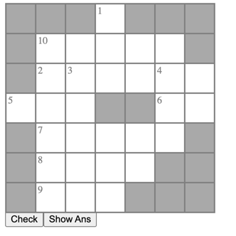
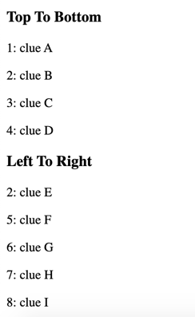
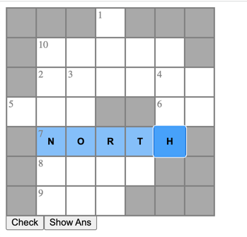

# crossword

It creates a CrossWord Board for the given data. Input data should be in below Format.

Steps:
1. Manually Prepare the CrossWord in Paper
2. Prepare Input  Data in below Format
3. Give Input data to CrossWord React Component. CrossWord Board will be created based on the data.

Features:
1. you can click on the Clue text to select/highlight respective boxes
2. you can navigate through boxes with keyboard arrow keys
3. special styles to identify the current box and selected row/column
4. check button to verify the answer and show Ans button to reveal correct ans.
5. it allows only alphabets
6. easy navigation

### Input Data Format 

```js
clues = [
    {
        clueNo: 1,
        startIndex: [0, 3],
        text: 'SEE',
        clueText: 'clue A',
        direction: 'top'
    },
    {
        clueNo: 2,
        startIndex: [2, 1],
        text: 'DENNV',
        clueText: 'clue B',
        direction: 'top'
    }
]
```

Please refer https://github.com/Muralikumar92/react-crossword/blob/main/src/utils/clues.js

### Empty Board and Clues





### Word Filling



### Verifying the Answer

